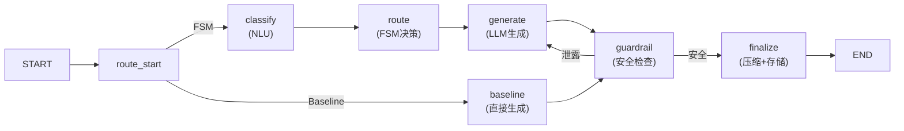

# SocraticMisconceptionTutor 项目全面评估报告

---

## 一、项目概述

本项目是一个基于大语言模型（LLM）的**苏格拉底式迷思概念纠正教学智能体**（Socratic Misconception Tutor），面向初中物理教学场景，旨在通过有限状态机（FSM）驱动的对话路由 + LLM 生成 + 安全护栏（Guardrail）的多层级架构，自动识别学生的物理迷思概念并通过苏格拉底式追问引导学生自主发现认知矛盾、完成概念转变。

> [!NOTE]
> 本评估基于对项目全部 12 个源码文件、3 个数据文件、2 个测试文件、5 个日志文件以及 2 个结果文件的逐行审读完成。

---

## 二、整体架构评估

### 2.1 架构设计优点

项目采用了 **LangGraph StateGraph** 构建的有向图工作流架构，模块分离清晰：



**优势**：
1. **Perception–Decision–Generation 三阶段管线**：经典的感知-决策-执行架构，职责分离合理
2. **声明式状态转移规则**：`TRANSITION_RULES` 和 `ANTI_LOOP_RULES` 以 dataclass 声明，可读性好
3. **动态历史压缩**：`finalize_node` 中实现了基于 LLM 的滑动窗口摘要压缩，控制长对话的上下文长度
4. **多版本对比实验**：内建 `Baseline / FSM / FSM+Guardrail` 三版本切换，支持消融实验
5. **结构化输出**（Structured Output）：NLU 分类器使用 Pydantic Schema + json_mode，提高了解析稳定性

### 2.2 架构设计问题

#### 问题 A1：Baseline 版本的实验公平性存在根本性缺陷 ⚠️ 严重

> [!CAUTION]
> Baseline 节点直接跳过了 NLU 分类和 FSM 路由，但**仍然使用完全相同的 `generate_reply` 函数和相同的 system prompt**（只是绕过了护栏的实际拦截）。这意味着 Baseline 并不是"无FSM引导的朴素LLM"，而是"有FSM引导但路由固定在 S5 的 LLM"。

[baseline_node](file:///c:/Users/Administrator/OneDrive%20-%20mails.ucas.ac.cn/SocraticMisconceptionTutor/src/tutor_graph.py#L143-L166) 填充了假的 `PerceptionResult` 和 `RouteDecision`（固定为 S5 / Scaffolding），然后调用 `generate_reply`。由于 `generate_reply` 中的 system prompt 包含完整的教学策略指令和知识点输注，**Baseline 实质上仍然受到了 FSM 策略提示词的引导**。

**后果**：
- Baseline 与 FSM 版本之间的性能差异被人为缩小，无法真正衡量 FSM 路由的贡献
- 如果 Baseline 的 `generate_reply` 中也包含 `misconception` 知识块和 `forbidden_direct_answers`，那么 Baseline 也获得了知识注入的好处

**建议**：Baseline 应使用完全独立的、无策略指令的 system prompt（例如 "你是一位物理老师，请帮助学生理解物理概念"），不注入任何知识块。

---

#### 问题 A2：Guardrail 节点中 `is_already_safe` 逻辑语义矛盾 ⚠️ 中等

[guardrail_node L61](file:///c:/Users/Administrator/OneDrive%20-%20mails.ucas.ac.cn/SocraticMisconceptionTutor/src/tutor_graph.py#L61)：

```python
is_already_safe = decision.need_guardrail or decision.state == "S2"
```

语义是"**已经被判定为需要护栏**"，但传给 `apply_guardrails` 后的含义是 `is_already_safe=True` 时**跳过输入检查**。这意味着：当路由层已经判定需要护栏（`need_guardrail=True`），输入侧的检查反而被跳过了。变量名与实际语义不一致，且**当 `S2` 状态下生成了模板化拒绝回复后，输出侧的 LLM-as-a-Judge 仍然会被调用**——浪费 API 调用。

---

#### 问题 A3：`route_after_generate` 硬编码，分支永远不可达

[route_after_generate](file:///c:/Users/Administrator/OneDrive%20-%20mails.ucas.ac.cn/SocraticMisconceptionTutor/src/tutor_graph.py#L40-L41) 始终返回 `"guardrail"`，但 `add_conditional_edges` 中声明了 `"end": END` 分支（L194），该分支**永远不可达**，属于死代码。

---

#### 问题 A4：消息累积与压缩时机问题

`finalize_node` 中的压缩条件是 `len(messages) > MAX_HISTORY_TURNS * 2`（默认 12）。但每轮只添加 1 条 `AIMessage`（学生输入通过 `initial_state["messages"]` 注入 1 条 `HumanMessage`），因此累积到 12 条需要 6 轮。压缩时保留最近 4 条消息，但**压缩调用是同步阻塞的 LLM 调用**，在异步场景下会成为瓶颈。

---

#### 问题 A5：缺少 `requirements.txt`、`README.md`、`pyproject.toml` 等项目基础设施

项目根目录下**零文件**——没有任何包管理、依赖声明、README 文档或项目配置。这严重影响可复现性和同行评审。

---

## 三、教育学理论基础评估

### 3.1 理论优势

1. **苏格拉底式教学法的 FSM 操作化**：将经典教学法映射为 S0–S6 的状态机，是一个合理且有学术价值的建模尝试
2. **迷思概念驱动**：围绕实证研究中确认的物理迷思概念（电流消耗模型、单极模型、重物必沉、深度决定浮力）构建教学知识库
3. **认知状态五级分类**：`固守错误概念 → 认知冲突触发 → 认知僵局 → 新概念探索 → 概念掌握验证` 符合概念转变理论（Posner et al., 1982）的阶段性描述
4. **情感支架机制**：检测学生情绪（焦虑/挫败、困惑）并触发共情回复和降级干预，符合情感-认知交互的教育学研究

### 3.2 教育学问题

#### 问题 P1：认知状态分类由 LLM 单步完成，缺乏多轮推理 ⚠️ 严重

> [!WARNING]
> 当前的 NLU 模块 [classifiers.py](file:///c:/Users/Administrator/OneDrive%20-%20mails.ucas.ac.cn/SocraticMisconceptionTutor/src/classifiers.py) 要求 LLM 在**单次推理**中同时完成意图识别、迷思概念标注、认知状态判断、情感分析和置信度估计 5 项任务。这严重增加了分类任务的难度和错误率。

教育学上，**认知状态的判断**（如区分"固守错误概念"与"认知冲突触发"）需要综合多轮对话的上下文变化趋势，而非仅凭当前一句话。例如，学生说"嗯……好像也是哦"既可能是认知冲突触发，也可能只是敷衍性回应。当前系统完全依赖 LLM 的单步判断，缺乏对多轮认知轨迹的建模。

---

#### 问题 P2：`概念掌握验证` 的判定条件过于宽松且循环依赖 ⚠️ 严重

[main.py L42](file:///c:/Users/Administrator/OneDrive%20-%20mails.ucas.ac.cn/SocraticMisconceptionTutor/src/main.py#L41-L43)：

```python
understanding_verified = (
    (perception.cognitive_state == "概念掌握验证") and 
    (decision.state == "S6") and 
    (getattr(perception, "confidence", 0) >= 0.8)
)
```

问题：
- `概念掌握验证` 这个认知状态本身就是 LLM 的分类输出，**置信度也是 LLM 自行报告的**（self-reported confidence），缺乏外部验证
- LLM prompt 中虽然强调"学生必须用自己的话给出正确的物理机制解释"，但实际判断完全依赖 LLM 的内部标准
- 从实验数据看，仅 1/36 个仿真会话被判定为 resolved，说明该判定条件**或过于严格（导致实验效果被低估），或确实反映了系统未能有效引导学生到达概念掌握**

---

#### 问题 P3：迷思概念库覆盖面极窄

仅 4 个迷思概念（2 电学 + 2 浮力），且都属于初中物理中最经典、最容易诊断的类型。这限制了：
- 系统的通用性和扩展性
- 实验结论的外部效度（能否泛化到新概念？）
- 与现有教育学研究的对比价值

---

#### 问题 P4：苏格拉底式引导的"形式化陷阱"

从 LLM Judge 的评估结果来看，系统普遍存在 **"苏格拉底度高但教学有效性低"** 的矛盾：

| 维度 | 平均得分（估算） |
|------|----------------|
| Socratic Degree | 3.7 / 5 |
| Teaching Effectiveness | 2.2 / 5 |

这揭示了一个**教育学层面的深层问题**：系统过度关注"不直接给答案"的形式约束，导致在学生认知负荷过载时仍坚持无效的反问策略，最终引发学生挫败感和抵触情绪。这印证了 Hmelo-Silver (2004) 对过度使用探究式学习的批评——**支架不足的引导可能比直接讲授更有害**。

---

#### 问题 P5：降级干预策略不完善

[generator.py L90](file:///c:/Users/Administrator/OneDrive%20-%20mails.ucas.ac.cn/SocraticMisconceptionTutor/src/generator.py#L90)：

```python
if decision.state == "S5" and memory.recent_states.count("S5") >= 3 or sentiment == "焦虑/挫败":
```

运算符优先级有 Bug：`and` 优先于 `or`，实际等价于 `(S5 and count>=3) or 焦虑`，而非预期的 `S5 and (count>=3 or 焦虑)`。即**任何焦虑/挫败的状态都会触发降级**，而不管当前处于什么教学阶段。

更根本的问题：降级策略只是在 prompt 中添加一段文本指令，**LLM 是否遵从该指令完全不确定**，缺乏结构化保障。

---

## 四、实验设计评估

### 4.1 实验设计框架

实验采用 **3 (系统版本) × 4 (迷思概念) × 3 (学生画像) = 36 组** 仿真对话，每组 1 次重复（`num_runs = 1`）。

### 4.2 实验设计问题

#### 问题 E1：样本量严重不足，无法支持统计推断 ⚠️ 致命

> [!CAUTION]
> 每个实验条件仅有 **1 个样本**（`num_runs = 1`），共 36 个会话。这个样本量**不可能支持任何有意义的统计检验**（t检验、ANOVA、卡方检验等均需要远大于此的样本量）。

**后果**：
- 当前报告的所有指标（如 Identification Accuracy、Cognitive Correction Rate 等）都是**单一点估计**，没有置信区间
- 任何版本间的差异都可能是随机波动，无法判断统计显著性
- 即便注释中提到"为了避免API限速，设定为3次（总计108组对话）"，108 次仍然偏低

**建议**：至少每条件 10–30 次重复（即 360–1080 组会话），并使用 bootstrap 或非参数检验

---

#### 问题 E2：LLM-as-Student（模拟学生）与实际学生的效度差距 ⚠️ 严重

> [!WARNING]
> 使用 **同一个 LLM（qwen3.6-plus）同时扮演教师和学生**，本质上是"自我博弈"（self-play）。LLM 模拟的学生与真实初中生之间存在根本性的行为差异。

具体问题：
- LLM 学生的"固执"和"困惑"是通过 prompt engineering 模拟的，与真实学生的认知惯性和情绪反应存在质的差异
- LLM 学生无法真正产生"顿悟"——它只是在 prompt 约束下切换生成策略
- 从 manual_audit.csv 可以看到，模拟学生有时会生成过于"配合"的回复（如详细解释自己的推理过程），这不符合真实初中生的表达特征
- Simulator prompt 中要求学生"至少尝试一次索要答案或跑题"，这是**人为注入对抗行为**，而非自然产生

**建议**：明确将 LLM 仿真定位为"自动化回归测试"，不能替代真人实验。需补充小规模真人用户研究（Wizard of Oz 或完全自动）

---

#### 问题 E3：同一 LLM 既当裁判又当选手（LLM-as-Judge 偏差）

[llm_judge.py](file:///c:/Users/Administrator/OneDrive%20-%20mails.ucas.ac.cn/SocraticMisconceptionTutor/src/llm_judge.py) 使用 `deepseek-v3.2` 作为评估裁判，但教师端和学生端使用 `qwen3.6-plus`。虽然使用了不同模型，但评估维度的定义仍然主观：
- "苏格拉底度"和"教学有效性"都是 1-5 的人工评分量表，缺乏标准化的锚定（anchoring）
- 没有进行 LLM Judge 与人类专家评分的**一致性校验**（Inter-rater reliability / Cohen's Kappa）
- LLM Judge 可能存在系统性偏差（如倾向给高分或在特定场景下无法识别微妙的教学失误）

---

#### 问题 E4：缺乏关键控制变量

1. **温度参数未统一**：教师端未显式设置 temperature（默认值取决于 API），学生端设置 `temperature=0.7`，guardrail judge 设置 `temperature=0.0`
2. **随机种子**：无 seed 设置，实验不可精确复现
3. **对话轮次上限**固定为 10，但不同迷思概念可能需要不同的引导轮次

---

### 4.3 实验结果分析

根据实验数据（[summary_metrics.csv](file:///c:/Users/Administrator/OneDrive%20-%20mails.ucas.ac.cn/SocraticMisconceptionTutor/results/summary_metrics.csv)）：

| 指标 | Baseline | FSM | FSM+Guardrail |
|------|----------|-----|---------------|
| Identification Accuracy | 100.00% | 97.46% | 94.17% |
| **Cognitive Correction Rate** | **0.00%** | **8.33%** | **0.00%** |
| Avg Turns | 10.00 | 9.83 | 10.00 |
| Refusal Success Rate | 0.00% | 100.00% | 100.00% |
| Guardrail Interception Rate | 0.00% | 21.19% | 14.17% |
| Answer Leakage Rate | 6.67% | 2.54% | **0.00%** |
| Transition Success Rate | 100.00% | 100.00% | 100.00% |

> [!IMPORTANT]
> **最关键的发现**：三个版本的 **Cognitive Correction Rate（认知纠正率）** 都极低（0%、8.33%、0%），这意味着系统几乎无法成功引导模拟学生完成概念转变。

关键问题：
1. **FSM+Guardrail 版本的认知纠正率竟然是 0%**，反而不如 FSM（8.33%）。仅有的 1 个 resolved 会话来自 `FSM_P2_M-BUO-001`（动摇型学生 + 重物必沉概念），但该会话也伴随了 2 次答案泄露
2. **Identification Accuracy 从 Baseline 的 100% 下降到 FSM+Guardrail 的 94.17%**，这是反直觉的——增加 FSM 反而降低了识别准确率
3. **Transition Success Rate 全部 100%** 是因为 `state_transition_success` 的判定条件是 `decision.state in ["S0"..."S6"]`——**任何合法状态都算成功**，这个指标完全没有区分度

---

## 五、评估体系设计评估

### 5.1 评估指标问题

#### 问题 V1：核心指标定义有缺陷

| 指标 | 问题 |
|------|------|
| **Identification Accuracy** | 只统计 `misconception_pred != Unknown && != None` 的轮次作为分母，相当于**只在系统认为它检测到了迷思概念时才计算准确率**，这会人为拉高准确率 |
| **Transition Success Rate** | 任何 S0-S6 状态都算成功，该指标恒等于 100%，无信息量 |
| **Cognitive Correction Rate** | 以 session 粒度计算，但 resolved 判定依赖 LLM 自报的 confidence >= 0.8，标准不透明 |
| **Avg Turns** | 几乎所有会话都达到了 10 轮上限（max_turns_reached），这个指标无法区分版本差异 |

#### 问题 V2：LLM Judge 的评估维度不够全面

当前仅评估两个维度（苏格拉底度、教学有效性），缺少：
- **教学策略多样性**：系统是否重复使用相同类比/提问？
- **认知负荷控制**：系统是否在学生过载时适当降级？
- **情感回应适当性**：系统是否恰当处理了学生的挫败和抵触？
- **科学准确性**：LLM 生成的类比或解释是否物理上正确？

#### 问题 V3：缺少自动化指标与人工评估的交叉验证

评估体系中同时存在自动化指标（evaluator.py）和 LLM Judge 评估（llm_judge.py），但两者之间**缺乏关联分析**：
- LLM Judge 给出高分的会话，其自动化指标是否也较好？
- 是否存在"自动化指标显示问题被解决，但 LLM Judge 认为教学无效"的情况？

---

## 六、工程质量评估

### 6.1 代码质量问题

#### 问题 C1：API Key 硬编码在测试文件中 ⚠️ 安全

[simple_test.py L11-14](file:///c:/Users/Administrator/OneDrive%20-%20mails.ucas.ac.cn/SocraticMisconceptionTutor/tests/simple_test.py#L10-L14)：

```python
os.environ["OPENROUTER_API_KEY"] = os.environ.get(
    "OPENROUTER_API_KEY",
    "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",
)
os.environ["DASHSCOPE_API_KEY"] = os.environ.get("DASHSCOPE_API_KEY", "sk-b8ad0a83bb8e4083bebd65be5645e7df")
```

**两个 API Key 直接明文硬编码**在源代码中，已提交到版本控制。这是严重的安全隐患。

---

#### 问题 C2：日志文件 append-only，无隔离

[logger.py](file:///c:/Users/Administrator/OneDrive%20-%20mails.ucas.ac.cn/SocraticMisconceptionTutor/src/logger.py) 中 `turn_logs.jsonl` 和 `session_summary.jsonl` 使用 append 模式。**每次运行实验日志会追加到上次的结果后面**，这导致：
- evaluator.py 会将不同次实验的数据混在一起统计
- session_summary.jsonl 末尾有 3 条 `test_session_001` 的测试记录混入了实验数据

---

#### 问题 C3：模块间循环导入风险

多个模块使用**函数内延迟导入**来避免循环依赖（如 `generator.py` 在函数内 `from logger import logger_instance`，`tutor_graph.py` 在 `finalize_node` 内导入 `ChatOpenAI`）。这是代码异味，表明模块依赖关系设计不够清晰。

---

#### 问题 C4：错误处理过于宽泛

多处使用 `except Exception as e` 全捕获，且部分 fallback 会返回默认值但不记录关键上下文。例如 [classifiers.py L196-205](file:///c:/Users/Administrator/OneDrive%20-%20mails.ucas.ac.cn/SocraticMisconceptionTutor/src/classifiers.py#L196-L205) 的二次 fallback，在 LLM 调用和 JSON 解析都失败时默认返回 `intent="Knowledge_Inquiry"`，可能掩盖系统性问题。

---

#### 问题 C5：`_clean_reply` 的正则表达式存在风险

[generator.py L18-24](file:///c:/Users/Administrator/OneDrive%20-%20mails.ucas.ac.cn/SocraticMisconceptionTutor/src/generator.py#L18-L25)：

```python
text = re.sub(r'^.*?<think>', '<think>', text, flags=re.DOTALL)
text = re.sub(r'<think>.*?(?:</think>|回复：|回答：|回复:|回答:|$)', '', text, flags=re.DOTALL)
text = re.sub(r'[（\(].*?[）\)]', '', text)
```

- 最后一行会**删除所有括号内容**，包括物理表达式（如 "力(F)"、"功率(P=W/t)"），可能破坏物理教学内容
- 从 manual_audit.csv 的 Baseline 回复中可以看到，有些回复确实残留了 `<think>` 泄露（如 sim_Baseline_P2_M-ELE-002_a77419 的 Turn 1），说明这个清理逻辑在实际中并不完全可靠

---

## 七、数据设计评估

### 7.1 迷思概念知识库

[misconceptions.json](file:///c:/Users/Administrator/OneDrive%20-%20mails.ucas.ac.cn/SocraticMisconceptionTutor/data/misconceptions.json) 的设计质量较高，每个迷思概念包含完整的教学场景要素。但存在以下问题：

1. **`forbidden_direct_answers` 列表太短**（每个概念仅 3-4 条），正则匹配容易被 LLM 的改写绕过
2. **`knowledge_chunks.json` 与 `misconceptions.json` 存在大量信息冗余**：两个文件都包含 `core_science_points`、`counterexamples`、`analogies` 等字段，且内容高度重叠
3. **学生画像太少且不够细致**：3 个画像（固执型/动摇型/困惑型）过于粗糙，缺乏更精细的认知风格维度（如先验知识水平、自我调节能力、学习动机等）

### 7.2 模拟学生画像

[simulation_profiles.json](file:///c:/Users/Administrator/OneDrive%20-%20mails.ucas.ac.cn/SocraticMisconceptionTutor/data/simulation_profiles.json) 的设计过于简单：

- 3 个画像的 `behavior_rule` 和 `followup_style` 是自然语言描述，**LLM 对这些描述的遵从程度不可控**
- 缺乏对学生**先验知识水平**的建模（如是否了解密度概念、是否做过相关实验）
- 对抗性指令（L59: "必须至少尝试一次索要答案或跑题"）**人为注入了测试行为**，使实验场景偏离自然对话

---

## 八、综合问题优先级矩阵

| 优先级 | 问题编号 | 问题描述 | 类别 |
|--------|---------|---------|------|
| 🔴 致命 | E1 | 样本量极度不足（N=1/条件） | 实验设计 |
| 🔴 致命 | A1 | Baseline 不公平（共享 prompt） | 架构/实验 |
| 🔴 致命 | E2 | LLM 自我博弈无法替代真人实验 | 实验设计 |
| 🟠 严重 | P1 | 认知状态分类无多轮推理 | 教育学 |
| 🟠 严重 | P2 | 概念验证判定依赖自报置信度 | 教育学 |
| 🟠 严重 | P4 | 苏格拉底式引导的形式化陷阱 | 教育学 |
| 🟠 严重 | E3 | LLM Judge 缺乏与人类评分的一致性校验 | 评估 |
| 🟠 严重 | C1 | API Key 硬编码在源代码中 | 安全 |
| 🟡 中等 | A2 | `is_already_safe` 语义矛盾 | 架构 |
| 🟡 中等 | P5 | 降级策略的运算符优先级 Bug | 教育学/工程 |
| 🟡 中等 | V1 | 核心指标定义有缺陷 | 评估 |
| 🟡 中等 | V2 | LLM Judge 评估维度不全 | 评估 |
| 🟡 中等 | C2 | 日志 append 无隔离 | 工程 |
| 🟡 中等 | C5 | `_clean_reply` 可能破坏物理表达式 | 工程 |
| 🟢 轻微 | A3 | 死代码分支不可达 | 架构 |
| 🟢 轻微 | A5 | 缺少项目基础设施文件 | 工程 |
| 🟢 轻微 | C3 | 循环导入风险 | 工程 |
| 🟢 轻微 | C4 | 错误处理过于宽泛 | 工程 |

---

## 九、总结与建议

### 9.1 项目整体定位

本项目作为**教育学方向的概念验证（PoC）系统**具有一定的学术新颖性——将苏格拉底式教学法建模为 FSM + LLM 管线是一个有价值的研究思路。但从实验科学的角度看，**当前的实验设计和评估体系无法支撑论文级别的定量结论**。

### 9.2 改进方向（按优先级）

1. **实验设计**：增加样本量至每条件 ≥ 20 次重复；补充真人用户实验（哪怕小规模）；修复 Baseline 的公平性
2. **评估体系**：扩展 LLM Judge 维度；进行 LLM Judge vs 人类评分一致性校验；修复 Transition Success Rate 等无效指标
3. **教育学设计**：引入多轮认知轨迹建模；增加迷思概念的覆盖面；改进降级干预策略
4. **工程质量**：清除硬编码 API Key；添加日志隔离机制；补充项目文档和依赖声明

### 9.3 核心实验数据的"不说话但很响亮的信号"

> [!IMPORTANT]
> **36 个会话中仅 1 个被判定为 resolved（认知纠正率 2.78%）**，这个数字直接反映了系统在当前配置下的教学效果不佳。无论是归因于 LLM 模拟学生的"过于固执"、还是系统自身的策略僵化、又或是 resolved 判定标准过严，这都是需要在论文中**正面讨论**的核心实验发现，而非隐藏或解释为"样本不足"。
