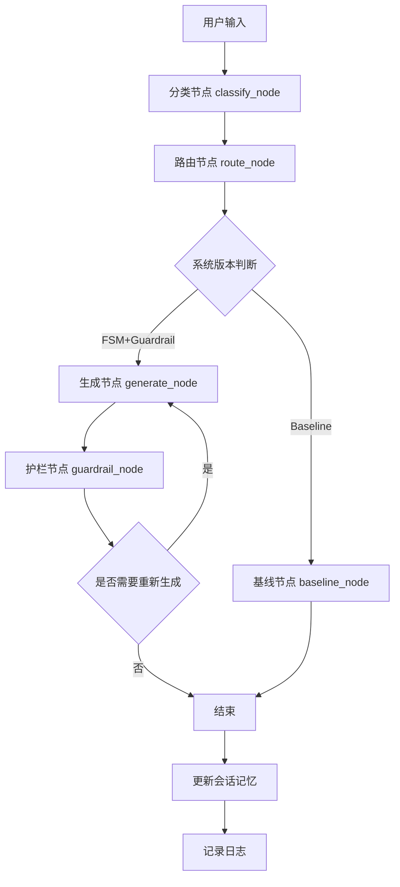

# 苏格拉底式对话教育智能体项目 Wiki

## 1. 项目概述

这是一个面向初中物理典型迷思概念（以电学与浮力为例）的苏格拉底式对话教育智能体。该智能体通过引导式对话帮助学生发现并纠正物理学习中的错误概念，而不是直接提供答案。

### 主要功能：
- 识别学生的错误概念和认知状态
- 基于认知状态进行智能路由和策略选择
- 生成引导性的问题和回复
- 应用安全护栏防止直接泄露答案
- 维护会话状态和记忆
- 详细的日志记录和会话跟踪

### 应用场景：
- 初中物理教学辅助
- 在线教育平台
- 个性化学习系统

## 2. 项目架构

### 2.1 整体架构

该项目采用基于状态图（State Graph）的架构设计，使用LangGraph库实现了一个有向图结构来管理对话流程。系统由以下核心组件组成：

1. **输入处理层**：负责解析和分类用户输入
2. **决策路由层**：基于输入和当前状态确定下一步操作
3. **回复生成层**：根据当前状态和策略生成引导性回复
4. **安全护栏层**：确保回复符合教育原则，不直接泄露答案
5. **记忆管理层**：维护会话状态和历史信息
6. **日志记录层**：记录系统运行状态和对话历史

### 2.2 数据流与处理流程



## 3. 核心模块与职责

### 3.1 主应用模块 (main.py)

**SocraticTutorApp** 类是整个应用的入口点，负责初始化会话、处理用户输入、调用状态图执行流程、更新会话记忆以及记录日志。

- **step()**: 处理单个用户输入并返回系统响应
- **astep()**: 异步版本的step()方法
- **end_session()**: 结束会话并记录会话总结
- **chat()**: 启动交互式对话界面
- **demo()**: 运行演示模式，使用预定义的示例输入

### 3.2 状态图模块 (graph.py)

定义了应用的状态图结构，包括各个节点和边的连接关系。状态图是系统的核心控制流，管理着对话的整个生命周期。

- **classify_node**: 对用户输入进行分类
- **route_node**: 基于分类结果进行路由决策
- **generate_node**: 生成系统回复
- **guardrail_node**: 应用安全护栏检查
- **baseline_node**: 处理基线版本的逻辑

### 3.3 状态管理模块 (state.py)

定义了系统的状态结构，包括会话记忆和当前轮次的处理结果。

- **GraphState**: 定义了LangGraph的状态结构

### 3.4 路由与记忆模块 (router.py)

负责会话记忆管理和路由决策，根据用户输入和当前状态确定下一步操作。

- **PerceptionResult**: 存储输入分类结果
- **SessionMemory**: 维护会话状态和历史信息
- **RouteDecision**: 存储路由决策结果
- **route_state()**: 基于感知结果和记忆进行路由决策
- **update_after_turn()**: 更新会话记忆
- **apply_transition_rules()**: 应用状态转移规则
- **_choose_strategy()**: 根据当前状态选择合适的教学策略

### 3.5 输入分类模块 (classifiers.py)

负责对用户输入进行分类，识别用户意图、错误概念、认知状态和情感状态。

- **classify_input()**: 对用户输入进行分类
- **NLUOutput**: 定义了自然语言理解的输出结构

### 3.6 回复生成模块 (generator.py)

根据当前状态和策略生成引导性的回复，避免直接给出答案。

- **generate_reply()**: 生成系统回复
- **_clean_reply()**: 清理回复文本
- **_load_json()**: 加载数据文件

### 3.7 安全护栏模块 (guardrails.py)

确保系统回复符合教育原则，不直接泄露答案。

- **apply_guardrails()**: 应用安全护栏检查
- **check_input()**: 检查输入是否存在风险
- **check_output()**: 检查输出是否泄露答案

### 3.8 日志模块 (logger.py)

记录系统运行状态和对话历史，便于后续分析和改进。

- **logger_instance**: 全局日志实例
- **log_turn()**: 记录单个对话轮次
- **log_session()**: 记录整个会话

### 3.9 配置模块 (config.py)

管理系统配置，包括API密钥、模型参数等。

## 4. 关键类与函数

### 4.1 SocraticTutorApp 类 (main.py)

```python
class SocraticTutorApp:
    def __init__(self, session_id: str, system_version: str = "FSM+Guardrail", student_profile: str = "Unknown", topic: str = "Unknown")
    def step(self, user_input: str) -> Dict[str, Any]
    async def astep(self, user_input: str) -> Dict[str, Any]
    def end_session(self, termination_reason: str = "resolved") -> None
    def chat(self) -> None
```

- **参数**:
  - `session_id`: 会话ID
  - `system_version`: 系统版本，可选值为"FSM+Guardrail"或"Baseline"
  - `student_profile`: 学生档案
  - `topic`: 对话主题

- **返回值**:
  - `step()`和`astep()`返回包含感知结果、决策结果、生成回复和护栏检查结果的字典

### 4.2 PerceptionResult 类 (router.py)

```python
@dataclass
class PerceptionResult:
    intent: str
    misconception_tag: Optional[str] = None
    cognitive_state: str = "认知僵局"
    sentiment: str = "平静"
    risk_flag: bool = False
    confidence: float = 0.0
```

- **属性**:
  - `intent`: 用户意图
  - `misconception_tag`: 错误概念标签
  - `cognitive_state`: 认知状态
  - `sentiment`: 情感状态
  - `risk_flag`: 风险标志
  - `confidence`: 分类置信度

### 4.3 SessionMemory 类 (router.py)

```python
@dataclass
class SessionMemory:
    session_id: str
    topic: Optional[str] = None
    current_state: str = "S0"
    current_misconception: Optional[str] = None
    turn_count: int = 0
    history_summary: str = ""
    messages: List[Dict[str, str]] = field(default_factory=list)
    used_strategies: List[str] = field(default_factory=list)
    recent_states: List[str] = field(default_factory=list)
    risk_events: List[str] = field(default_factory=list)
    resolved: bool = False
```

- **属性**:
  - `session_id`: 会话ID
  - `topic`: 对话主题
  - `current_state`: 当前状态
  - `current_misconception`: 当前错误概念
  - `turn_count`: 对话轮次
  - `history_summary`: 历史对话总结
  - `messages`: 对话消息列表
  - `used_strategies`: 使用过的策略列表
  - `recent_states`: 最近的状态列表
  - `risk_events`: 风险事件列表
  - `resolved`: 问题是否解决

### 4.4 RouteDecision 类 (router.py)

```python
@dataclass
class RouteDecision:
    state: str
    state_name: str
    strategy: Optional[str]
    need_guardrail: bool
    next_goal: str
    meta: Dict[str, Any] = field(default_factory=dict)
```

- **属性**:
  - `state`: 状态代码
  - `state_name`: 状态名称
  - `strategy`: 教学策略
  - `need_guardrail`: 是否需要护栏
  - `next_goal`: 下一目标
  - `meta`: 元数据

### 4.5 classify_input 函数 (classifiers.py)

```python
def classify_input(user_input: str, messages: List[Dict[str, str]] = None, history_summary: str = "") -> PerceptionResult
```

- **参数**:
  - `user_input`: 用户输入
  - `messages`: 对话历史消息
  - `history_summary`: 历史对话总结

- **返回值**:
  - `PerceptionResult`: 包含输入分类结果的对象

### 4.6 route_state 函数 (router.py)

```python
def route_state(perception: PerceptionResult, memory: SessionMemory) -> RouteDecision
```

- **参数**:
  - `perception`: 输入分类结果
  - `memory`: 会话记忆

- **返回值**:
  - `RouteDecision`: 包含路由决策结果的对象

### 4.7 generate_reply 函数 (generator.py)

```python
def generate_reply(user_input: str, decision: RouteDecision, memory: SessionMemory, history_summary: str = "") -> Dict[str, Any]
```

- **参数**:
  - `user_input`: 用户输入
  - `decision`: 路由决策结果
  - `memory`: 会话记忆
  - `history_summary`: 历史对话总结

- **返回值**:
  - 包含生成回复和相关信息的字典

### 4.8 apply_guardrails 函数 (guardrails.py)

```python
def apply_guardrails(user_input: str, intent: str, generated_text: str, misconception_tag: Optional[str], is_already_safe: bool = False) -> Dict[str, Any]
```

- **参数**:
  - `user_input`: 用户输入
  - `intent`: 用户意图
  - `generated_text`: 生成的回复文本
  - `misconception_tag`: 错误概念标签
  - `is_already_safe`: 是否已经安全

- **返回值**:
  - 包含护栏检查结果的字典

## 5. 状态与策略

### 5.1 状态定义

| 状态代码 | 状态名称 | 描述 |
|---------|---------|------|
| S0 | Listen_And_Analyze | 监听和分析用户输入 |
| S1 | Guardrail_Check | 护栏检查 |
| S2 | Refusal_And_Guidance | 拒绝直接回答并引导 |
| S3 | Misconception_Diagnosis | 错误概念诊断 |
| S4 | Cognitive_Conflict | 认知冲突 |
| S5 | Scaffolding_Guidance | 支架式引导 |
| S6 | Verification_Deepening | 验证深化 |

### 5.2 教学策略

| 策略名称 | 描述 | 适用状态 |
|---------|------|----------|
| Assumption_Probing | 暴露学生结论背后的隐含前提，制造认知冲突 | S4 |
| Consequence_Exploration | 把学生当前解释继续推演，检验其后果是否合理 | S4, S6 |
| Clarification | 澄清学生表述中的模糊概念，找准真正的认知问题 | S5 |
| Evidence_Seeking | 引导学生用现象、实验或理由支持自己的判断 | S5, S6 |
| Analogical_Scaffolding | 用有边界的类比支架帮助学生跨过理解障碍 | S5 |

### 5.3 错误概念标签

| 标签 | 错误概念 | 主题 |
|-----|---------|------|
| M-ELE-001 | 认为电流在电路中会被消耗(如灯泡用掉电流) | 电学 |
| M-ELE-002 | 认为电路不需要闭合回路，单线即可工作 | 电学 |
| M-BUO-001 | 认为物体越重越容易沉，越轻越容易浮 | 浮力 |
| M-BUO-002 | 认为水压越大浮力越大，浮力随深度增加 | 浮力 |

## 6. 依赖关系

### 6.1 核心依赖

| 依赖 | 版本 | 用途 |
|-----|------|------|
| Python | 3.8+ | 运行环境 |
| langchain | 最新版 | 构建LLM应用 |
| langchain_openai | 最新版 | 调用OpenAI API |
| langgraph | 最新版 | 构建状态图 |
| pydantic | 最新版 | 数据验证 |
| tenacity | 最新版 | 重试机制 |
| deepseek | 最新版 | LLM模型 |

### 6.2 模块依赖关系

```mermaid
graph TD
    main.py --> graph.py
    main.py --> router.py
    main.py --> logger.py
    graph.py --> state.py
    graph.py --> classifiers.py
    graph.py --> router.py
    graph.py --> generator.py
    graph.py --> guardrails.py
    classifiers.py --> router.py
    classifiers.py --> config.py
    generator.py --> router.py
    generator.py --> config.py
    guardrails.py --> config.py
    router.py --> config.py
```

## 7. 项目运行方式

### 7.1 环境配置

1. 安装依赖：
   ```bash
   pip install -r requirements.txt
   ```

2. 配置API密钥：
   在 `config.py` 文件中设置 `DEEPSEEK_API_KEY` 和其他配置参数。

### 7.2 运行方式

#### 7.2.1 交互式对话

```bash
python src/main.py
```

系统会启动一个交互式对话界面，您可以输入问题或陈述，系统会生成引导性的回复。

#### 7.2.2 演示模式

```bash
python src/main.py demo
```

系统会使用预定义的示例输入运行演示，展示系统的功能。

### 7.3 配置参数

主要配置参数位于 `config.py` 文件中：

- `DEEPSEEK_API_KEY`: DeepSeek API密钥
- `LLM_MODEL`: 使用的LLM模型
- `LLM_BASE_URL`: LLM API基础URL
- `MAX_HISTORY_TURNS`: 最大历史对话轮次
- `RETRY_STOP_ATTEMPT`: 重试次数
- `RETRY_MIN_WAIT`: 最小重试等待时间
- `RETRY_MAX_WAIT`: 最大重试等待时间

## 8. 项目结构

```
├── data/                 # 数据文件
│   ├── adversarial_inputs.json     # 对抗性输入
│   ├── knowledge_chunks.json       # 知识点
│   ├── misconceptions.json         # 错误概念
│   ├── simulation_profiles.json    # 模拟档案
│   ├── strategy_templates.json     # 策略模板
│   └── test_cases_normal.json      # 正常测试用例
├── docs/                 # 文档
│   ├── experiment_versions.md      # 实验版本
│   ├── scope_freeze.md             # 范围冻结
│   ├── state_machine_v1.md         # 状态机v1
│   ├── 开题：面向初中物理典型迷思概念（以电学与浮力为例）的苏格拉底式对话教育智能体设计与实现.pdf
│   └── 计划安排.md
├── logs/                 # 日志文件
│   ├── pipeline_2026-04-12_19-21-51.log
│   ├── session_summary.jsonl
│   └── turn_logs.jsonl
├── src/                  # 源代码
│   ├── classifiers.py    # 输入分类
│   ├── config.py         # 配置
│   ├── evaluator.py      # 评估器
│   ├── generator.py      # 回复生成
│   ├── graph.py          # 状态图
│   ├── guardrails.py     # 安全护栏
│   ├── llm_judge.py      # LLM判断器
│   ├── logger.py         # 日志
│   ├── main.py           # 主应用
│   ├── router.py         # 路由
│   ├── simulator.py      # 模拟器
│   └── state.py          # 状态管理
└── tests/                # 测试
    └── simple_test.py    # 简单测试
```

## 9. 日志与监控

系统会在 `logs/` 目录下生成以下日志文件：

- `pipeline_*.log`: 管道运行日志
- `session_summary.jsonl`: 会话总结日志
- `turn_logs.jsonl`: 对话轮次日志

日志内容包括会话ID、系统版本、学生档案、主题、错误概念、用户输入、意图预测、错误概念预测、认知状态预测、当前状态、使用的策略、护栏触发情况、生成的回复等信息。

## 10. 扩展与定制

### 10.1 添加新的错误概念

1. 在 `data/misconceptions.json` 文件中添加新的错误概念定义
2. 在 `data/knowledge_chunks.json` 文件中添加相应的知识点
3. 在 `classifiers.py` 文件中更新错误概念标签列表

### 10.2 添加新的教学策略

1. 在 `router.py` 文件中的 `STATE_STRATEGIES` 字典中添加新策略
2. 在 `STRATEGY_GOALS` 字典中添加策略目标
3. 在 `_choose_strategy` 函数中添加策略选择逻辑

### 10.3 自定义状态转移规则

在 `router.py` 文件中的 `TRANSITION_RULES` 和 `ANTI_LOOP_RULES` 列表中添加新的规则。

## 11. 故障排除

### 11.1 常见问题

| 问题 | 原因 | 解决方案 |
|-----|------|----------|
| API密钥错误 | API密钥未设置或无效 | 在 `config.py` 中设置正确的API密钥 |
| 生成回复失败 | LLM调用失败 | 检查网络连接和API密钥，查看日志了解具体错误 |
| 状态循环 | 状态转移规则不当 | 调整 `ANTI_LOOP_RULES` 中的规则 |
| 护栏误触发 | 护栏规则过于严格 | 调整 `guardrails.py` 中的规则或阈值 |

### 11.2 日志分析

通过分析 `logs/` 目录下的日志文件，可以了解系统运行状态和问题原因。特别关注以下信息：

- 会话ID和时间戳
- 错误概念识别结果
- 状态转移情况
- 护栏触发情况
- LLM调用错误

## 12. 总结与亮点回顾

### 12.1 项目亮点

1. **基于状态图的架构**：使用LangGraph实现了灵活的状态管理和流程控制
2. **苏格拉底式教学方法**：通过引导性问题帮助学生发现和纠正错误概念
3. **多维度认知分析**：综合考虑用户意图、错误概念、认知状态和情感状态
4. **安全护栏机制**：防止直接泄露答案，确保教育效果
5. **自适应策略选择**：根据学生状态和对话历史动态选择教学策略
6. **完善的记忆管理**：维护会话状态和历史信息，提供连贯的学习体验
7. **详细的日志记录**：便于后续分析和改进

### 12.2 应用价值

该项目为初中物理教育提供了一种新的教学辅助工具，通过苏格拉底式对话帮助学生建立正确的物理概念，培养科学思维能力。系统可以：

- 识别和纠正常见的物理错误概念
- 适应不同学生的学习风格和认知水平
- 提供个性化的学习体验
- 减轻教师的教学负担
- 为教育研究提供数据支持

### 12.3 未来发展方向

1. 扩展到更多物理领域和其他学科
2. 增加更多错误概念和教学策略
3. 优化LLM调用，提高响应速度和准确性
4. 开发用户友好的前端界面
5. 集成到现有的教育平台
6. 基于用户反馈持续改进系统性能

## 13. 参考资料

- [LangChain 文档](https://python.langchain.com/docs/get_started/introduction)
- [LangGraph 文档](https://docs.langchain.com/langgraph)
- [DeepSeek API 文档](https://platform.deepseek.com/docs/api)
- [苏格拉底式教学法](https://en.wikipedia.org/wiki/Socratic_method)
- [初中物理教学大纲](https://www.gov.cn/zhengce/zhengceku/2022-04/21/content_5686562.htm)