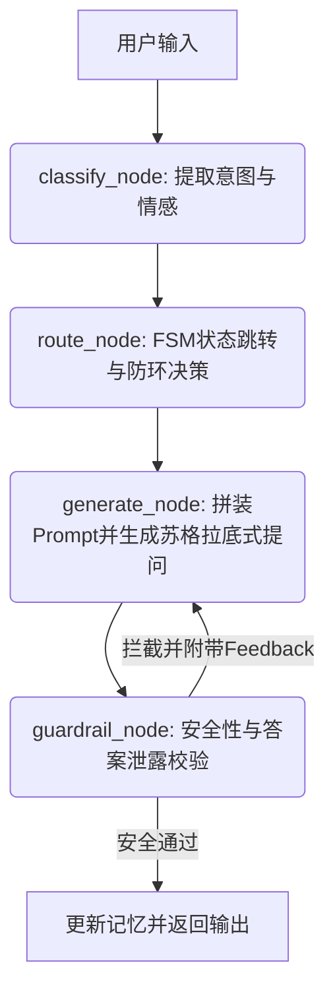

# 项目代码维基 (Code Wiki) - 苏格拉底式对话教育智能体

## 1. 项目整体架构 (Overall Architecture)

本项目是一个面向初中物理典型迷思概念（如电学、浮力）的**苏格拉底式对话教育智能体**。
系统采用基于大语言模型（LLM）和有限状态机（FSM）相结合的混合架构，并通过 **LangGraph** 实现了模块化、高可控的图工作流调度。

整个对话流程被抽象为一个有向图（StateGraph），每次用户输入都会经历以下核心流水线流转：
1. **感知 (Classify)**：NLU 意图识别与情感分析。
2. **决策 (Route)**：基于规则与 FSM 的对话状态路由。
3. **生成 (Generate)**：基于当前策略和情感支架生成苏格拉底式的引导回复。
4. **护栏 (Guardrail)**：LLM-as-a-Judge 判别是否存在直接给出答案（泄漏）等风险。若存在，则将反馈作为条件，循环回“生成”节点进行重写（柔性护栏机制）。

---

## 2. 主要模块职责 (Main Module Responsibilities)

### 核心业务逻辑 (`src/`)
*   **`main.py`**: 系统入口。定义了 `SocraticTutorApp` 核心类，负责会话管理、记忆更新、调用 LangGraph 工作流以及本地日志记录，同时提供交互式 Demo。
*   **`graph.py`**: 编排层。使用 LangGraph 定义并编译了 `workflow = StateGraph(GraphState)`。负责注册节点（classify, route, generate, guardrail）和条件边（如重试循环、结束）。
*   **`classifiers.py`**: 感知层（NLU）。利用大模型的结构化输出能力，将用户的非结构化文本解析为 `意图(Intent)`、`错误概念(Misconception)`、`认知状态(Cognitive State)` 以及 `情绪(Sentiment)`。
*   **`router.py`**: 决策层（FSM）。维护对话状态（S0-S6），包含基于 `TransitionRule` 的声明式防死循环与状态流转规则，根据分类结果输出具体的引导策略和下一步目标。
*   **`generator.py`**: 生成层。负责拼装包含知识点、反例、类比和系统指令的 System Prompt，并依据情感状态（如“焦虑/挫败”）动态注入【情感支架】，调用大模型生成苏格拉底式的提问回复。
*   **`guardrails.py`**: 安全层。综合应用正则匹配与 LLM-as-a-Judge，拦截偏题请求和助教的“答案泄露”行为。
*   **`state.py`**: 数据模型层。定义了 LangGraph 在各节点间流转的全局状态类型 `GraphState`。
*   **`config.py`**: 配置层。集中管理 API 密钥、模型名称、超时与 Tenacity 重试（Retry）配置。
*   **`logger.py`**: 日志层。负责将会话级（`session_summary.jsonl`）和轮次级（`turn_logs.jsonl`）日志落盘。

### 评估与测试层
*   **`simulator.py`**: 高逼真度自动化仿真模块。内置 `SimulatedStudent`，模拟带有特定人格和错误物理观念的初中生，与系统进行对抗性自动对话。
*   **`evaluator.py`**: 定量评估模块。解析日志并计算认知纠正率、平均对话轮数、护栏拦截率等指标。
*   **`llm_judge.py`**: 定性评估模块。作为教育学专家裁判，对历史对话的“苏格拉底度”和“教学有效性”进行 1-5 分的打分和点评。
*   **`tests/` 目录**: 包含各类功能测试（如 `run_simple_test.py` 快速验证大模型链路、`test_s2_off_topic.py` 测试偏题情感支架等）。

### 数据层 (`data/`)
*   `misconceptions.json`: 预定义的物理错误概念（如 M-ELE-001 电流消耗论）。
*   `knowledge_chunks.json`: 对应的正确物理知识、核心反例与类比支架。
*   `simulation_profiles.json`: 模拟学生的性格画像配置。

---

## 3. 关键类与函数说明 (Key Classes and Functions)

### 3.1 核心数据结构 (Data Structures)
*   **`GraphState`** (`state.py`): TypedDict，包含 `memory`, `user_input`, `perception`, `decision`, `generation`, `guardrail_result`, `regeneration_required`，是贯穿整个 LangGraph 生命周期的状态总线。
*   **`PerceptionResult`** (`router.py`): NLU 解析结果容器，包含 `intent`, `misconception_tag`, `cognitive_state`, `sentiment`, `risk_flag`, `confidence`。
*   **`RouteDecision`** (`router.py`): 路由决策容器，包含下发给生成器的 `state`（如 S4 认知冲突）、`strategy`（如 推演后果）、`need_guardrail`、`next_goal` 以及透传信息的 `meta`。
*   **`SessionMemory`** (`router.py`): 管理单次会话的长期记忆，记录对话历史列表、历史摘要（`history_summary`）、近期状态流转列表等，以应对长文本截断和死循环检测。

### 3.2 关键函数 (Key Functions)
*   **`classify_input(user_input, messages, history_summary)`** (`classifiers.py`):
    调用 LLM 返回 `NLUOutput` JSON。若失败，采用基于正则的 Fallback 机制提取，保证系统鲁棒性。
*   **`apply_transition_rules(target, perception, memory)`** (`router.py`):
    使用 `TRANSITION_RULES` 和 `ANTI_LOOP_RULES` 声明式规则列表，处理状态流转和破解“S4/S5 死循环”。
*   **`generate_reply(user_input, decision, memory, history_summary)`** (`generator.py`):
    组装包含核心科学知识点、反例、类比的 Prompt。如果检测到反馈包含 `guardrail_feedback`，则注入要求重新生成的系统警告；如果检测到学生有负面情感，则注入【情感支架】。
*   **`apply_guardrails(...)`** (`guardrails.py`):
    包含 `check_input`（拦截违规意图）和 `check_output`（检测大模型是否泄露答案）。`check_output` 具备基于 Tenacity 的 `@retry` 机制。

---

## 4. 依赖关系与数据流 (Dependencies & Data Flow)

### 4.1 第三方依赖
*   `langgraph`: 用于定义图工作流节点和边。
*   `langchain_openai`: 统一的 LLM 调用接口（配置对接 DeepSeek）。
*   `pydantic`: 提供结构化解析的数据模型定义（NLUOutput, GuardrailOutput）。
*   `tenacity`: 为网络调用（大模型请求、模拟学生生成等）提供指数退避重试（Retry）机制。

### 4.2 核心图数据流向


---

## 5. 项目运行方式 (How to Run)

### 5.1 环境变量配置
在运行任何脚本前，需配置大模型 API Key（本项目默认采用 DeepSeek）：
```bash
export DEEPSEEK_API_KEY="sk-xxxxxx"
export LLM_MODEL="deepseek-chat" # 默认值
```

### 5.2 运行交互式 Demo
以控制台聊天的形式启动应用，体验苏格拉底式对话：
```bash
python src/main.py
```

### 5.3 运行轻量级连通性测试
用于验证所有模块（包括大模型、NLU、生成、护栏等）是否正常协同工作，避免运行大规模耗时仿真：
```bash
python tests/run_simple_test.py
```
或执行具体的异常情况验证：
```bash
python tests/test_s2_off_topic.py
```

### 5.4 运行大规模批量仿真 (Simulation)
利用 `SimulatedStudent` 进行不同错误概念和学生画像的对抗性对话测试：
```bash
python src/simulator.py
```
测试完成后，可通过以下命令评估指标和生成日志：
```bash
python src/evaluator.py
python src/llm_judge.py
```
运行产生的数据和分析报告将保存至 `logs/` 和 `results/` 目录下。
