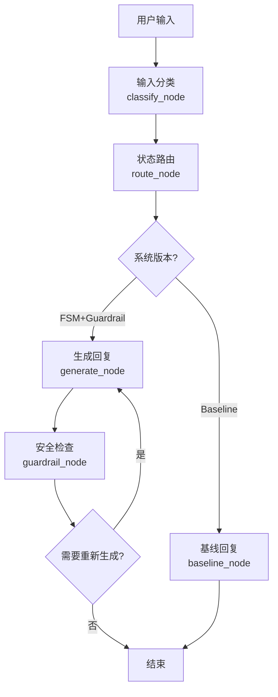

# 苏格拉底式对话教育智能体 - Code Wiki

## 1. 项目概览

这是一个面向初中物理典型迷思概念（以电学与浮力为例）的苏格拉底式对话教育智能体。该系统通过引导式对话帮助学生理解物理概念，纠正错误认知，而不是直接提供答案。

**主要功能：**
- 识别学生的错误概念和认知状态
- 基于状态机的动态教学策略调整
- 生成引导性问题和类比
- 安全护栏机制防止直接泄露答案
- 完整的会话管理和日志记录

**典型应用场景：**
- 初中物理教学辅助
- 学生自主学习辅导
- 教育研究与评估

## 2. 目录结构

```
├── src/             # 源代码目录
│   ├── main.py      # 主应用入口
│   ├── graph.py     # 状态机工作流定义
│   ├── router.py    # 路由和状态管理
│   ├── classifiers.py # 输入分类和误解检测
│   ├── generator.py # 回复生成
│   ├── guardrails.py # 安全护栏
│   ├── state.py     # 状态结构定义
│   ├── config.py    # 配置信息
│   ├── logger.py    # 日志记录
│   └── simulator.py # 模拟工具
├── data/            # 数据文件目录
│   ├── misconceptions.json       # 错误概念定义
│   ├── knowledge_chunks.json     # 知识点和教学资源
│   ├── simulation_profiles.json  # 模拟用户配置
│   └── test_cases_normal.json    # 测试用例
├── logs/            # 日志文件目录
├── tests/           # 测试目录
└── docs/            # 文档目录
```

## 3. 系统架构与主流程

### 3.1 整体架构

系统采用基于LangGraph的状态机架构，主要包含以下核心组件：

1. **输入处理层**：负责分析用户输入，识别意图、错误概念和认知状态
2. **状态管理层**：基于输入分析结果和历史状态，决定下一步教学状态和策略
3. **回复生成层**：根据当前状态和策略，生成引导性回复
4. **安全护栏层**：确保回复符合苏格拉底式教学原则，不直接给出答案
5. **会话管理层**：维护会话状态和历史记录

### 3.2 主流程图



## 4. 核心模块详解

### 4.1 主应用模块 (main.py)

**SocraticTutorApp** 类是系统的核心入口，负责初始化会话、处理用户输入、执行状态机工作流并返回结果。

**主要功能：**
- 初始化会话内存和状态
- 处理用户输入并执行状态机
- 记录会话日志
- 提供交互式对话界面

**关键方法：**
- `step(user_input)`: 处理单个用户输入并返回系统响应
- `chat()`: 启动交互式对话界面
- `end_session()`: 结束会话并记录总结

### 4.2 状态机模块 (graph.py)

使用LangGraph构建的状态机工作流，定义了系统的核心处理流程。

**主要节点：**
- `classify_node`: 输入分类，分析用户意图和认知状态
- `route_node`: 状态路由，决定下一步教学状态和策略
- `generate_node`: 生成回复，基于当前状态和策略
- `guardrail_node`: 安全检查，确保回复符合教学原则
- `baseline_node`: 基线模式，提供简单回复

**状态流转：**
- 输入分类 → 状态路由 → 生成回复 → 安全检查 → (重新生成或结束)

### 4.3 路由模块 (router.py)

负责状态管理和策略选择，是系统的决策核心。

**核心类：**
- `PerceptionResult`: 输入感知结果，包含意图、错误概念、认知状态等
- `SessionMemory`: 会话内存，记录会话状态和历史
- `RouteDecision`: 路由决策，包含目标状态、策略和元数据

**关键函数：**
- `route_state()`: 根据感知结果和内存状态决定下一步状态
- `apply_transition_rules()`: 应用状态转移规则，防止死循环
- `_choose_strategy()`: 根据当前状态和历史选择合适的教学策略

### 4.4 分类模块 (classifiers.py)

负责分析用户输入，识别意图、错误概念、认知状态和情感状态。

**核心功能：**
- 使用LLM进行结构化自然语言理解
- 识别预定义的错误概念标签
- 评估用户的认知状态和情感状态
- 处理API调用失败的降级策略

**错误概念标签：**
- M-ELE-001: 认为电流在电路中会被消耗(如灯泡用掉电流)
- M-ELE-002: 认为电路不需要闭合回路，单线即可工作
- M-BUO-001: 认为物体越重越容易沉，越轻越容易浮
- M-BUO-002: 认为水压越大浮力越大，浮力随深度增加

### 4.5 生成模块 (generator.py)

负责生成符合当前状态和策略的引导性回复。

**核心功能：**
- 加载错误概念和知识点数据
- 根据当前状态和策略构建系统提示
- 生成符合苏格拉底式教学原则的回复
- 清理回复文本，去除思考标签和动作提示

**回复类型：**
- 拒绝直接回答并引导 (S2)
- 认知冲突问题 (S4)
- 支架式提示 (S5)
- 验证提示 (S6)

### 4.6 安全护栏模块 (guardrails.py)

确保系统回复符合苏格拉底式教学原则，不直接给出答案。

**核心功能：**
- 检查输入是否存在直接求答案、偏题等风险
- 检查输出是否泄露答案
- 结合规则匹配和LLM-as-a-Judge进行深度语义检测
- 处理API调用失败的降级策略

**安全规则：**
1. 绝不直接给出最终结论或标准答案
2. 绝不代替学生完成关键的逻辑推理过程
3. 只能通过提问、制造矛盾（认知冲突）或提供类比来进行引导
4. 回复必须简短、自然，符合日常口语习惯

### 4.7 状态模块 (state.py)

定义系统的状态结构，用于LangGraph的状态管理。

**GraphState** 类型包含：
- 系统版本
- 会话内存
- 用户输入
- 感知结果
- 路由决策
- 生成结果
- 安全检查结果
- 重新生成标志

## 5. 核心 API/类/函数

### 5.1 SocraticTutorApp (main.py)

**参数：**
- `session_id`: 会话ID
- `system_version`: 系统版本，默认为"FSM+Guardrail"
- `student_profile`: 学生 profile，默认为"Unknown"
- `topic`: 主题，默认为"Unknown"

**返回值：**
- `step()`: 返回包含感知、决策、生成和安全检查结果的字典
- `chat()`: 无返回值，启动交互式对话
- `end_session()`: 无返回值，结束会话并记录总结

### 5.2 classify_input (classifiers.py)

**参数：**
- `user_input`: 用户输入文本
- `messages`: 历史消息列表，可选
- `history_summary`: 历史对话总结，可选

**返回值：**
- `PerceptionResult` 对象，包含意图、错误概念、认知状态等

### 5.3 route_state (router.py)

**参数：**
- `perception`: 感知结果
- `memory`: 会话内存

**返回值：**
- `RouteDecision` 对象，包含目标状态、策略和元数据

### 5.4 generate_reply (generator.py)

**参数：**
- `user_input`: 用户输入文本
- `decision`: 路由决策
- `memory`: 会话内存
- `history_summary`: 历史对话总结，可选

**返回值：**
- 包含原始回复、最终回复、回复类型等信息的字典

### 5.5 apply_guardrails (guardrails.py)

**参数：**
- `user_input`: 用户输入文本
- `intent`: 用户意图
- `generated_text`: 生成的回复文本
- `misconception_tag`: 错误概念标签
- `is_already_safe`: 是否已经是安全回复，可选

**返回值：**
- 包含安全检查结果的字典

### 5.6 update_after_turn (router.py)

**参数：**
- `memory`: 会话内存
- `user_input`: 用户输入文本
- `final_reply`: 最终回复文本
- `history_summary`: 历史对话总结，可选
- `understanding_verified`: 是否验证了理解，可选

**返回值：**
- 更新后的 `SessionMemory` 对象

## 6. 技术栈与依赖

| 技术/依赖 | 用途 | 来源 |
|-----------|------|------|
| Python | 主要开发语言 | <mcfile name="config.py" path="/workspace/src/config.py"></mcfile> |
| LangChain | LLM 应用框架 | <mcfile name="classifiers.py" path="/workspace/src/classifiers.py"></mcfile> |
| LangGraph | 状态机工作流 | <mcfile name="graph.py" path="/workspace/src/graph.py"></mcfile> |
| OpenAI API | LLM 服务 (DeepSeek) | <mcfile name="config.py" path="/workspace/src/config.py"></mcfile> |
| Tenacity | 重试机制 | <mcfile name="classifiers.py" path="/workspace/src/classifiers.py"></mcfile> |
| Pydantic | 数据模型 | <mcfile name="classifiers.py" path="/workspace/src/classifiers.py"></mcfile> |

## 7. 配置与部署

### 7.1 环境变量

| 环境变量 | 描述 | 默认值 |
|---------|------|--------|
| DEEPSEEK_API_KEY | DeepSeek API 密钥 | "" |
| LLM_MODEL | LLM 模型名称 | "deepseek-chat" |
| LLM_BASE_URL | LLM API 基础 URL | "https://api.deepseek.com" |

### 7.2 配置参数

| 参数 | 描述 | 值 |
|------|------|------|
| RETRY_MIN_WAIT | 最小重试等待时间 | 2 |
| RETRY_MAX_WAIT | 最大重试等待时间 | 10 |
| RETRY_STOP_ATTEMPT | 最大重试次数 | 3 |
| MAX_HISTORY_TURNS | 保留的历史对话轮数 | 6 |

### 7.3 运行方式

1. **设置环境变量**：
   ```bash
   export DEEPSEEK_API_KEY=your_api_key
   ```

2. **运行演示**：
   ```bash
   python src/main.py
   ```

3. **交互式对话**：
   ```bash
   # 在代码中调用 chat() 方法
   app = SocraticTutorApp(session_id="demo")
   app.chat()
   ```

## 8. 数据模型

### 8.1 错误概念数据 (misconceptions.json)

```json
{
  "id": "M-ELE-001",
  "misconception_name": "电流消耗论",
  "description": "认为电流在电路中会被消耗，例如灯泡会用掉电流",
  "forbidden_direct_answers": ["电流不会被消耗", "串联电路中电流处处相等"],
  "verification_questions": ["如果电流会被消耗，后面的灯泡会怎样？"]
}
```

### 8.2 知识块数据 (knowledge_chunks.json)

```json
{
  "misconception_tag": "M-ELE-001",
  "core_science_points": ["串联电路中电流处处相等", "电流是电荷的定向移动"],
  "counterexamples": ["如果电流会被消耗，后面的灯泡会越来越暗"],
  "analogies": [
    {
      "analogy": "水流过水车后，水的总量不变，只是把能量传递给了水车"
    }
  ]
}
```

## 9. 日志与监控

系统使用 `logger.py` 模块进行日志记录，主要包括：

- 会话初始化日志
- 每轮对话的详细日志
- 会话结束的总结日志
- 错误和警告日志

日志文件存储在 `logs/` 目录中，包括：
- `pipeline_*.log`: 管道执行日志
- `session_summary.jsonl`: 会话总结日志
- `turn_logs.jsonl`: 每轮对话的详细日志

## 10. 测试与评估

### 10.1 测试文件

- `tests/simple_test.py`: 简单功能测试
- `test_classifier.py`: 分类器测试
- `test_generator.py`: 生成器测试
- `test_graph.py`: 状态机测试
- `test_run.py`: 运行测试

### 10.2 评估指标

- 错误概念识别准确率
- 认知状态评估准确性
- 安全护栏有效性
- 学生学习效果
- 对话流畅度和自然度

## 11. 常见问题与解决方案

### 11.1 API 调用失败

**问题**：DeepSeek API 调用失败
**解决方案**：系统会自动重试（最多3次），如果仍然失败，会使用降级策略返回默认响应。

### 11.2 安全护栏误报

**问题**：安全护栏误判正常回复为违规
**解决方案**：系统使用双重检查机制（规则匹配 + LLM-as-a-Judge），并允许最多3次重新生成尝试。

### 11.3 状态死循环

**问题**：系统在某个状态卡住
**解决方案**：系统实现了防死循环规则，当检测到连续多次进入同一状态时，会强制转移到其他状态。

## 12. 扩展与未来发展

### 12.1 潜在扩展方向

- 支持更多物理概念和错误概念
- 增加多语言支持
- 集成知识图谱，提供更丰富的教学资源
- 开发Web界面，提高用户体验
- 增加学生进度跟踪和个性化教学

### 12.2 技术改进

- 优化LLM调用，减少响应时间
- 增加更多教学策略和支架类型
- 改进错误概念识别的准确性
- 增强安全护栏的智能性
- 开发自适应学习路径算法

## 13. 总结

苏格拉底式对话教育智能体是一个创新的教育技术应用，通过引导式对话帮助学生理解物理概念，纠正错误认知。系统采用先进的LLM技术和状态机架构，实现了智能化的教学流程管理和个性化的学习引导。

该系统不仅可以作为初中物理教学的辅助工具，也可以为教育AI的发展提供有价值的参考。通过不断优化和扩展，有望在未来为更多学科和年龄段的学生提供高质量的个性化学习体验。